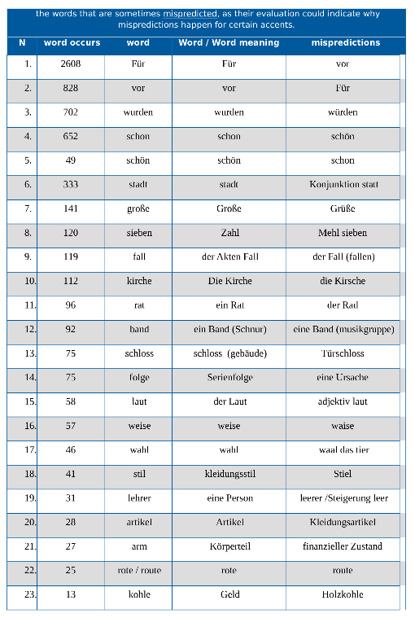
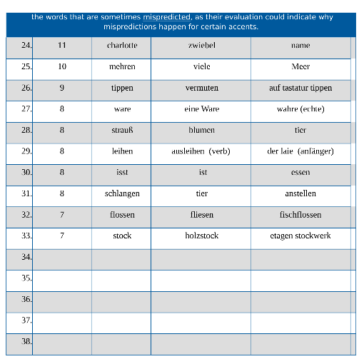

### Word Count Occurrences
In order to count the number of occurrences of each word over the sentences located in the transcripts column of a data frame:

the code is included in the file [count_word_occurrences.ipynb](https://github.com/MohamedMesto/ASR-Accent-Analysis-De/blob/main/Word_and_utternace/count_word_occurrences.ipynb)
Which displays the following table

Some of the words that are sometimes mispredicted are shown in the file [words_that_are_sometimes_mispredicted.pdf](https://github.com/MohamedMesto/ASR-Accent-Analysis-De/blob/main/Word_and_utternace/words_that_are_sometimes_mispredicted.pdf)

Which displays the following table

